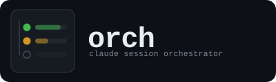

<p align="center">
  
</p>

<p align="center">
  <em>You are the team. Orch is your ops layer.</em>
</p>

<p align="center">
  <a href="https://github.com/odmarkj/orch/blob/main/LICENSE"></a>
  
  =3.11">
  
  <a href="TODO-buymeacoffee-url"></a>
</p>

<p align="center">
  <a href="#who-this-is-for">Who This Is For</a> &bull;
  <a href="#quick-start">Quick Start</a> &bull;
  <a href="#how-it-works">How It Works</a> &bull;
  <a href="#architecture">Architecture</a> &bull;
  <a href="#cli-commands">CLI Commands</a> &bull;
  <a href="#interface-shortcuts">Interface Shortcuts</a> &bull;
  <a href="#getting-started">Getting Started</a> &bull;
  <a href="#billing--subscription-usage">Billing</a> &bull;
  <a href="#contributing">Contributing</a>
</p>

---

## Who this is for

You're one person — or maybe two or three — shipping real products. Not a 20-person team with dedicated DevOps, a QA department, and CI pipelines that someone else maintains. **You** write the code, run the dev server, test locally, fix the bug, push to production, and handle the customer email that comes in while you're doing all of that. Across multiple projects.

Claude Code changed the game — you can move faster than ever. But now the bottleneck isn't writing code. It's everything around it:

- **You're the context switch.** Five projects open, five terminal tabs, five different states of "where was I?" You `cd` between them, re-read the last commit, try to remember what you were doing. The overhead eats the speed Claude gave you.
- **You can't see what's happening.** Claude is running in one tab. Is it done? Is it stuck waiting for a yes/no? Is it spinning on a bad approach? You won't know until you check — and you're in another tab.
- **Permission prompts kill flow.** Claude asks to write a file. You approve. Claude asks to run a test. You approve. Claude asks to edit another file. Twenty interruptions into a task that should have been autonomous.
- **Nothing tells you what matters.** Ten projects, ten TODO lists, ten different levels of "almost shipped." You pick whatever feels urgent, not what actually moves the needle. Three projects sit in MVP purgatory for weeks.
- **Local iteration has no structure.** You test by hand, eyeball the output, push when it looks right. There's no feedback loop between "Claude wrote code" and "this actually works" that doesn't involve you sitting there watching.

### Where orch fits

Orch is the ops layer for the person who is the team. It doesn't assume you have CI. It doesn't assume someone else reviews your PRs. It gives you a single terminal where every project is visible, every Claude session is tracked, and the work that matters floats to the top.

| Your day without orch | Your day with orch |
|-------------|-----------|
| Open five terminal tabs, `cd` into each project, try to remember where you left off | Open orch. Every project is there. Status dots show what's running, what's waiting, what's idle. |
| Claude asks permission 20 times during a refactor. You babysit the tab. | Claude runs in an isolated VM session with full permissions. You check back when it's done. |
| A Claude session needs input. You don't notice for 40 minutes. | macOS notification fires. iTerm2 tab opens with the session resumed. You answer, move on. |
| You start the day staring at ten projects. Pick one based on gut feeling. | `orch plan` reads every project's stage, stall score, pending todos, and tells you the three that matter today. |
| A project sits in "almost done" for three weeks because nothing reminds you. | Stall detection flags it. Launch debt score rises. The day planner keeps surfacing it until you ship or kill it. |
| You want to knock out five small tasks but can only run one Claude at a time. | Press `g`. Orch dispatches them in parallel — three at once, each in its own worktree — and opens PRs when they're done. |

---

## Quick Start

```bash
# Clone and install
git clone https://github.com/odmarkj/orch.git
cd orch
pip install -e . --break-system-packages

# First-time setup (iTerm2 profile, Lima VM, tools)
orch setup

# Start the VM and launch
orch vm start
orch
```

That's it. Orch auto-discovers any project under `~/Apps/` (or your configured root) with a `.git/` directory. No registration, no config files per project — just code.

---

## How It Works

Everything runs on your machine. No cloud services, no CI dependency, no team infrastructure required. Orch operates through a few core systems that work together:

### Live status monitoring

Each project's Claude session writes a one-line status to `.claude/status` after every response. Orch watches these files via filesystem events — zero polling, instant updates. Status dots in the TUI show green (active), yellow (waiting for input), or dim (idle).

When Claude needs input, it writes to `.claude/waiting_for_input`. Orch fires a macOS notification and opens an iTerm2 tab with the session already resumed. You answer, Claude continues, the file is deleted, the dot goes green.

### VM execution environment

> **Migration note (v0.3):** Orch originally used per-project Docker containers
> for isolation. This was replaced with a single Lima VM for simplicity,
> efficiency, and speed — session start dropped from minutes (container build)
> to sub-second (tmux attach), and CPU/memory overhead dropped dramatically
> since there's only one VM instead of N containers. The mount namespace
> sandbox (`unshare --mount`) provides equivalent write isolation without
> container boundaries.

When you select a project, orch connects to a single Lima VM running Ubuntu with Apple's Virtualization.framework and virtiofs mounts. Your `~/Apps` directory is mounted at the same path inside the VM, so all file paths resolve identically — no path translation, no mount hacks.

Inside the VM, Claude runs with `--dangerously-skip-permissions` in a sandboxed mount namespace — `~/Apps` is read-only except for the current project directory. This means fully autonomous operation within a project — no permission prompts interrupting multi-step tasks — while preventing cross-project writes.

Each session runs inside a **systemd scope**, so when a session ends (or you close the iTerm2 window), every process it spawned — background servers, dev watchers, build tools — is automatically cleaned up. No orphaned processes accumulating in the long-running VM.

Per-project environment isolation is handled by **direnv** (environment variables) and **mise** (Python/Node/Go toolchain versions). No containers to start up, rebuild, or configure per project.

**Environment variables** — each project can have a `.envrc` file loaded by direnv. A parent `.envrc` in `~/Apps/` can hold shared credentials (API tokens, etc.) inherited by all projects.

### Reference projects

All projects under `~/Apps/` are accessible at their original paths inside the VM. You can tell Claude "look at how project-x handles rate limiting" and it already knows where to find them — no special configuration needed.

### Auto-dispatch with parallel worktrees

When auto-dispatch is enabled (`g` in the TUI), orch automatically picks up pending todos from `TODOS.md` and runs them — each in its own git worktree with a dedicated Claude instance. Up to 3 tasks run in parallel by default (configurable via `max_parallel`).

The full pipeline for each dispatched todo:

1. **Worktree created** — a new branch `auto/<slug>-<random>` is checked out in `../.orch-worktrees/`
2. **Claude works the task** — runs autonomously in the worktree with `--dangerously-skip-permissions`
3. **Code review** (optional) — a second Claude instance reviews the diff for bugs, security issues, and quality
4. **Commit & push** — changes are committed and pushed to the branch with retry backoff
5. **PR created** — a pull request is opened via `gh` CLI with the task description and review findings
6. **Cleanup** — worktree is removed, local branch is deleted, todo is marked `[x]`, next pending todo fills the slot

This means you can add 10 todos to a project, press `g`, and walk away. Orch will churn through them 3 at a time, each producing a PR ready for merge.

### Code review

Per-project opt-in. Add `code_review = true` to `.orch/project.toml`:

```toml
[project]
name = "my-project"
code_review = true
```

When enabled, after Claude finishes a task but before the commit and PR, a separate Claude instance reviews the diff. The review is included in the PR body and posted as a comment.

### Project lifecycle

Every project tracks its stage in `.orch/project.toml`:

```
idea → building → mvp → staging → live → maintaining
```

The ledger is append-only — every transition is dated and noted. Orch uses this history to detect stalled projects (current gap > 1.5x the project's own average pace) and calculates **launch debt** — days spent in `mvp` or `staging` without shipping. Both feed into the day planner.

---

## Architecture

```
Host (macOS)                          Lima VM (Ubuntu)
┌──────────────────┐                  ┌──────────────────────────┐
│ orch TUI (app.py)│──── SSH ────────▶│ tmux sessions per agent  │
│ watchdog on       │                  │ direnv + mise per project│
│ ~/Apps/*/.claude/ │◀── virtiofs ───▶│ ~/Apps/* (same paths)    │
│                   │                  │ claude CLI (global)      │
│ iTerm2 tabs       │                  │ docker engine            │
│ (SSH into VM)     │                  │ k3s                      │
│                   │                  │ VNC server               │
└──────────────────┘                  └──────────────────────────┘
```

### Key design decisions

- **Filesystem events over polling** — Watchdog monitors `.claude/` directories for instant status updates with zero CPU overhead. virtiofs propagates events natively without Docker Desktop's filesystem overhead.
- **Single VM execution** — All Claude sessions run inside one Lima VM with virtiofs mounts at host paths. No containers to build, start, or manage per project. Session start is sub-second (tmux attach) vs. minutes for container builds.
- **Per-project isolation via direnv + mise** — Environment variables and toolchain versions are isolated per project without container boundaries. `--add-dir` prevents cross-project writes.
- **No dependencies beyond the stdlib** — The TOML parser and Anthropic API client are hand-rolled. Only `textual` (TUI) and `watchdog` (file events) are external.
- **iTerm2 via SSH + tmux** — Sessions connect to the VM via `limactl shell` with tmux for persistence. Clipboard, images, and paste all work natively — no container boundary to cross.
- **Append-only ledger** — Project lifecycle transitions are never edited, only appended. Full audit trail for stall detection and planning.

---

## CLI Commands

```bash
orch                                # Launch TUI
orch plan                           # Generate AI day plan
orch plan --json                    # Day plan as JSON
orch stage <project> <stage>        # Advance project lifecycle stage
orch stage <project> <stage> note   # With a note in the ledger
orch logs <project>                 # Show recent session output
orch logs <project> -g error        # Grep filter
orch logs <project> --past          # Read saved log files
orch bridge                         # Start mobile web bridge (Ctrl-C to stop)
orch vm start                       # Start the Lima VM
orch vm stop                        # Stop the Lima VM
orch vm status                      # Check VM status
orch vm ssh                         # SSH into the VM
orch vm create                      # Create VM from template
orch ignore <project>               # Hide project from orch
orch ignore <project> --undo        # Un-hide project
orch setup                          # First-time setup
```

### Day planner

`orch plan` makes a single Claude API call with context from every project: stage, stall score, launch debt, pending todos, git activity, and current Claude status. Returns a prioritized plan with focus projects (max 4), rationale, and suggested tasks pulled from your `TODOS.md`.

Requires `ANTHROPIC_API_KEY` in your environment or iTerm2 profile.

---

## Interface Shortcuts

### TUI keybindings

| Key | Action |
|-----|--------|
| `j` / `k` or arrows | Navigate project list |
| `Enter` | Select project |
| `t` | Send a task to Claude in VM |
| `a` | Add a todo to TODOS.md |
| `g` | Toggle auto-dispatch (parallel worktrees) |
| `e` | Open iTerm2 tab with Claude (host) |
| `c` | Open iTerm2 window with Claude (VM session) |
| `x` | Open VM shell at project directory |
| `dd` | Stop agent session |
| `l` | View session logs |
| `p` | Generate day plan in iTerm2 tab |
| `b` | Toggle mobile web bridge on/off |
| `s` | Set project stage (`stage` or `stage: note`) |
| `i` | Ignore/hide selected project from orch |
| `r` | Rescan projects directory |
| `o` | Edit ~/.orch/config.toml |
| `q` | Quit |
| `Escape` | Cancel input |

### TODOS.md format

```markdown
## Pending
- [ ] Build flavor profile recommendation engine
- [ ] Vectorize the tasting notes corpus

## In Progress
- [~] Refactor SMS outreach sequence

## Done
- [x] Set up pgvector schema
```

Pending count shows next to the project name in the TUI. Claude marks items in-progress and done automatically as it works.

---

## Getting Started

### Installation

```bash
git clone https://github.com/odmarkj/orch.git
cd orch
pip install -e . --break-system-packages
```

### First-time setup

```bash
orch setup
```

`orch setup` will:
1. Install the iTerm2 dynamic profile
2. Verify macOS notification support
3. Check for Lima and offer to install via Homebrew
4. Create the Lima VM (downloads Ubuntu, installs tools — 5-10 minutes)
5. Check for the GitHub CLI (`gh`)
6. Create `~/.orch/config.toml` with default settings

### Enable live status in your projects

Add the contents of `CLAUDE_SNIPPET.md` to the `CLAUDE.md` of each project you want orch to track. This instructs Claude to:

- Write a one-line status to `.claude/status` after every response
- Write questions to `.claude/waiting_for_input` when it needs you
- Mark `TODOS.md` items as in-progress (`[~]`) and done (`[x]`)

### Configuration

`orch setup` creates `~/.orch/config.toml`:

```toml
[iterm]
profile = "orch"
dedicated_window = true
window_title = "orch sessions"

[notifications]
sound_input_needed = "Glass"
sound_resumed = "Pop"
notify_on_resume = true

[vm]
# Lima VM name (matches lima/orch.yaml template)
name = "orch"

[dispatch]
# Max Claude instances running in parallel per project (each gets a worktree)
max_parallel = 3

[bridge]
port = 7777

[planner]
model = "claude-sonnet-4-20250514"
```

### Per-project config

Projects can have their own settings in `.orch/project.toml`:

```toml
[project]
name = "my-project"

# Enable automatic code review on dispatched tasks (off by default)
code_review = true

[hooks]
# Run when the first session starts for this project
on_first_session = "sudo systemctl start docker"
# Run when the last session ends
on_last_session = "sudo systemctl stop docker"
```

Hooks run inside the VM at the project directory. Use them to start/stop services that a project needs (databases, k3s, Docker, etc.) so they only run on demand instead of consuming resources permanently.

### Per-project toolchain (optional)

Use mise for per-project Python/Node/Go versions:

```toml
# .mise.toml in project root
[tools]
python = "3.12"
node = "22"
```

Use direnv for per-project environment variables:

```bash
# .envrc in project root
source_up_if_exists   # inherit parent .envrc
use mise              # activate mise-managed toolchain
export MY_API_KEY="..."
```

### Mobile access

Full TUI works on iPad via SSH. `orch plan` and `orch stage` work well on phone. See [MOBILE.md](MOBILE.md) for the complete setup guide with Termius and Cloudflare Tunnel instructions.

### File reference

| File | Purpose |
|------|---------|
| `~/Apps/<project>/.claude/status` | One-line live status, written by Claude |
| `~/Apps/<project>/.claude/waiting_for_input` | Claude's question; triggers notification + iTerm2 tab |
| `~/Apps/<project>/.claude/pending_task` | Task queued from orch, read by Claude |
| `~/Apps/<project>/.claude/sessions.json` | `{"active": "<session-id>"}` for `--resume` |
| `~/Apps/<project>/.claude/auto_dispatch` | Auto-dispatch enabled flag (existence = on) |
| `~/Apps/<project>/.claude/active_todo` | Currently dispatched todo text |
| `~/Apps/<project>/.claude/last_review.md` | Most recent code review output |
| `~/Apps/<project>/TODOS.md` | Project todo list |
| `~/Apps/<project>/.orch/project.toml` | Lifecycle stage, ledger, and per-project config |
| `~/Apps/.orch-worktrees/` | Temporary worktrees for parallel dispatch |
| `~/.orch/config.toml` | Orch configuration |
| `~/.orch/logs/<project>/` | Session log files |

---

## VM Capabilities

The Lima VM provides a full Linux environment with:

- **Docker Engine** — run `docker compose up` for multi-service stacks
- **k3s** — native Kubernetes cluster for testing full applications
- **VNC** — attach a display at `localhost:5900` for GUI debugging
- **Port forwarding** — dev server ports (3000-9999) auto-forward to host
- **SSH agent** — GitHub auth passes through automatically
- **Wrangler** — run local Cloudflare Workers dev servers

---

## Billing & Subscription Usage

Orch is **not** a third-party Claude client. It launches the official `claude` CLI binary — Anthropic's own Claude Code — as a subprocess for every session, both interactive and headless. Orch never implements its own API client or authentication layer; it simply orchestrates the first-party tool you already have installed.

This matters because Anthropic's [billing policy](https://support.anthropic.com/en/articles/11145840-how-does-usage-based-billing-work-for-the-claude-max-plan) distinguishes between:

- **First-party tools** (Claude Code, Claude chat, Claude Cowork) — usage counts against your subscription.
- **Third-party harnesses** (tools that connect to your Claude account via their own API client) — usage draws from extra usage credits, not your subscription.

Since orch launches `claude` directly, all usage is attributed to Claude Code and counts as normal subscription usage. No extra usage charges apply.

---

## System Requirements

- **Python** >= 3.11
- **macOS** (iTerm2 integration uses AppleScript, Lima uses Apple Virtualization.framework)
- **Lima** (`brew install lima`) — lightweight Linux VM
- **iTerm2** (for tab management and notifications)
- **macOS notifications** — uses built-in `osascript`; ensure Focus/Do Not Disturb is off

Optional:
- **GitHub CLI** (`brew install gh`) — enables auto-dispatch PR creation and code review comments
- **Cloudflare Tunnel** — for mobile access outside your home network

---

## Contributing

Contributions are welcome! Please:

1. Fork the repository
2. Create a feature branch
3. Make your changes
4. Submit a Pull Request

### Development

```bash
git clone https://github.com/odmarkj/orch.git
cd orch
pip install -e . --break-system-packages
orch setup
```

### Project structure

```
orch/
├── orch/                  # Python package
│   ├── __init__.py
│   ├── __main__.py        # CLI entry point and subcommand routing
│   ├── app.py             # Textual TUI application
│   ├── agent.py           # Agent session management (tmux, worktrees, dispatch)
│   ├── bridge.py          # Mobile web bridge (HTTP server + REST API)
│   ├── comm.py            # Cross-project agent communication protocol
│   ├── discovery.py       # Auto-discovery of projects in ~/Apps
│   ├── iterm.py           # iTerm2 tab management and notifications
│   ├── lifecycle.py       # Project stages, ledger, stall detection
│   ├── logs.py            # Session log capture and rotation
│   ├── models.py          # Project and Session data models
│   ├── planner.py         # AI day planner (Claude API)
│   ├── setup.py           # First-time setup wizard
│   └── vm.py              # Lima VM lifecycle management
├── lima/
│   └── orch.yaml          # Lima VM template (Ubuntu, virtiofs, provisioning)
├── profiles/
│   └── orch-iterm2-profile.json  # iTerm2 dynamic profile
├── CLAUDE_SNIPPET.md      # Status integration snippet for projects
├── MOBILE.md              # Mobile access setup guide
├── pyproject.toml         # Package configuration
└── README.md
```

---

## License

MIT

---

## Support

- **Bug reports** — [GitHub Issues](https://github.com/odmarkj/orch/issues)
- **Feature requests** — [GitHub Issues](https://github.com/odmarkj/orch/issues)

---

## Sponsors

A special thanks to our project sponsors:

<p align="center">
  <a href="https://localdataexchange.com">
    
  </a>
</p>

---

<p align="center">
  <sub>Built for people who ship, not people who manage people who ship.</sub>
</p>
